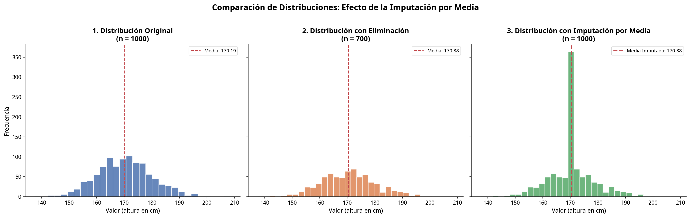
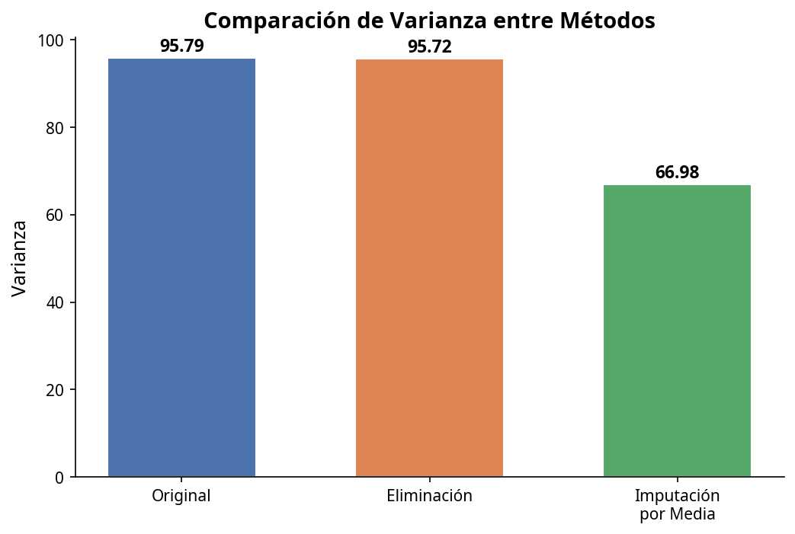
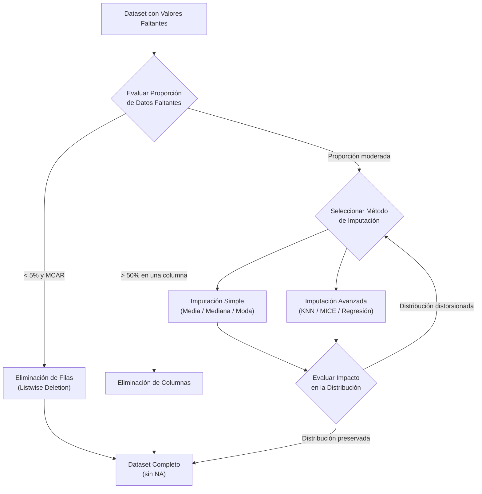
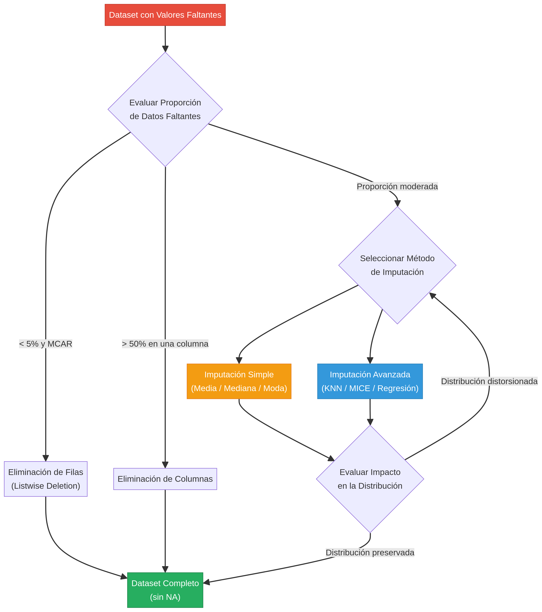
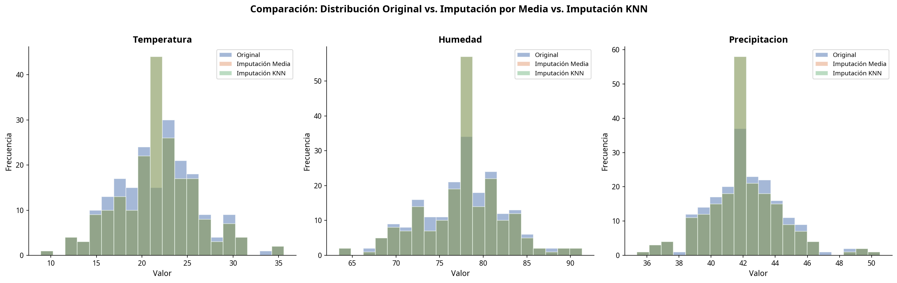
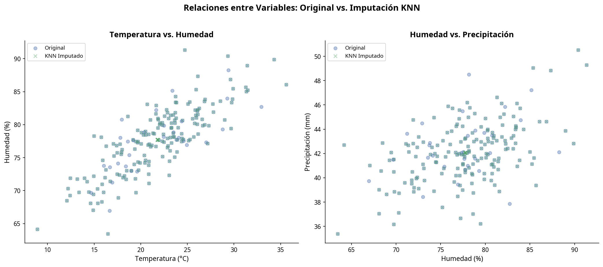

# Datos Faltantes y Métodos de Imputación en Ciencia de Datos

**Handling Missing Data and Imputation Methods in Data Science**

> *Una guía técnica y educativa sobre el problema de los valores faltantes en datasets y los métodos de imputación, desde técnicas simples hasta K-Nearest Neighbors (KNN).*

**Autor:** Guillermo · ICTA Ltda.
**Fecha:** Marzo 2026
**Licencia:** CC BY 4.0

---

## Tabla de Contenidos

1.  [Introducción al Problema de los Datos Faltantes](#1-introducción-al-problema-de-los-datos-faltantes)
2.  [El Problema de los Valores NA en el Análisis de Datos](#2-el-problema-de-los-valores-na-en-el-análisis-de-datos)
3.  [Métodos Simples para Tratar Datos Faltantes](#3-métodos-simples-para-tratar-datos-faltantes)
4.  [Métodos Simples de Imputación](#4-métodos-simples-de-imputación)
5.  [Ejemplo Visual del Problema de Imputar la Media](#5-ejemplo-visual-del-problema-de-imputar-la-media)
6.  [Flujo de Decisión para el Tratamiento de Datos Faltantes](#6-flujo-de-decisión-para-el-tratamiento-de-datos-faltantes)
7.  [Imputación mediante K-Nearest Neighbors (KNN)](#7-imputación-mediante-k-nearest-neighbors-knn)
8.  [Conclusiones](#8-conclusiones)
9.  [Referencias](#9-referencias)

---

## 1. Introducción al Problema de los Datos Faltantes

Los **datos faltantes** (o *missing data* en inglés) constituyen una de las problemáticas más frecuentes y desafiantes en el análisis de datos y la ciencia de datos aplicada. Se definen como la ausencia de valores para una o más variables en una o más observaciones de un conjunto de datos. Su presencia puede originarse por múltiples causas: errores en la recolección de datos, fallas en sensores de medición, omisiones en encuestas, problemas de integración de bases de datos o incluso la negativa deliberada de los participantes a proporcionar cierta información [1].

Independientemente de su origen, los datos faltantes representan un desafío significativo para el modelado estadístico y el aprendizaje automático. Si no se manejan adecuadamente, pueden conducir a conclusiones sesgadas, modelos predictivos con menor rendimiento y una reducción general en la validez de los resultados de cualquier investigación o proyecto analítico.

### 1.1 Categorías de Datos Faltantes

Para abordar el problema de manera efectiva, es fundamental comprender el **mecanismo** que genera la ausencia de datos. Little y Rubin (2002) [1] propusieron una taxonomía que se ha convertido en el estándar de referencia, clasificando los datos faltantes en tres categorías:

| Categoría | Nombre Completo | Descripción | Ejemplo |
| :--- | :--- | :--- | :--- |
| **MCAR** | Missing Completely At Random | La probabilidad de que un dato falte es la misma para todas las observaciones y no depende de ningún valor, observado o no. | Un sensor falla aleatoriamente por un problema eléctrico. |
| **MAR** | Missing At Random | La probabilidad de ausencia depende de los valores observados de otras variables, pero no del valor del dato faltante en sí. | Los hombres son menos propensos a responder una pregunta sobre salud que las mujeres. |
| **MNAR** | Missing Not At Random | La probabilidad de ausencia depende del propio valor que falta. | Las personas con ingresos muy altos son más reacias a revelar sus ingresos. |

La distinción entre estas categorías es crucial porque determina qué métodos de tratamiento son apropiados. Los datos MCAR son los más sencillos de manejar, ya que la submuestra completa sigue siendo representativa de la población. Los datos MAR pueden tratarse adecuadamente con métodos de imputación que consideren las relaciones entre variables. Los datos MNAR son los más problemáticos, ya que requieren modelos explícitos del mecanismo de ausencia para evitar sesgos [3].

---

## 2. El Problema de los Valores NA en el Análisis de Datos

La presencia de valores `NA` (Not Available) o nulos en un conjunto de datos no es un mero inconveniente técnico; es un problema que puede invalidar análisis estadísticos completos y comprometer la fiabilidad de modelos de machine learning si no se aborda con rigor.

### 2.1 Errores en Operaciones Matemáticas y Modelos Estadísticos

La mayoría de las operaciones estadísticas fundamentales —como el cálculo de la media, la varianza, la correlación o la regresión— no están definidas para valores indefinidos. En la práctica, la suma de un vector que contiene un `NA` resultará en `NA`, y esta indefinición se propaga a través de toda la cadena de cálculos. En Python, librerías como `NumPy` y `pandas` representan estos valores como `NaN` (Not a Number), lo que permite que los cálculos continúen sin errores de ejecución, pero el resultado final sigue siendo un valor indefinido que no aporta información útil.

### 2.2 Pérdida de Información y Reducción del Poder Estadístico

Una estrategia frecuente consiste en eliminar las filas que contienen valores faltantes (*listwise deletion*). Si bien esto resuelve el problema técnico inmediato, tiene un costo elevado: al reducir el tamaño de la muestra, disminuye el **poder estadístico** de las pruebas. Esto significa que se reduce la capacidad de detectar efectos reales en los datos, lo que puede llevar a conclusiones erróneas de "no significancia" cuando en realidad existe una relación subyacente [3].

### 2.3 Introducción de Sesgos (Biases)

El problema más insidioso del manejo incorrecto de datos faltantes es la introducción de **sesgos**. Si los datos no son MCAR, eliminarlos puede distorsionar la distribución de las variables y las relaciones entre ellas. Por ejemplo, si en un estudio sobre salarios las personas con ingresos más altos son más reacias a responder, eliminar estas observaciones hará que el salario promedio calculado sea artificialmente más bajo que el promedio real de la población. El modelo resultante estaría sesgado y no generalizaría adecuadamente [1].

### 2.4 Impacto en Algoritmos de Machine Learning

La mayoría de los algoritmos de machine learning —regresión lineal, regresión logística, máquinas de soporte vectorial (SVM), redes neuronales— no pueden funcionar con datos faltantes. Las implementaciones estándar de `scikit-learn` arrojarán un error al intentar entrenar un modelo con un dataset que contiene `NaN`. Esto obliga al científico de datos a aplicar una estrategia de preprocesamiento para tratar los valores faltantes antes de poder iniciar el modelado [2].

---

## 3. Métodos Simples para Tratar Datos Faltantes

Ante la presencia de datos faltantes, las primeras soluciones que suelen considerarse son las más directas: eliminar las observaciones o variables problemáticas. Aunque estos métodos son fáciles de implementar, deben usarse con precaución.

### 3.1 Eliminación de Filas (Listwise Deletion)

La **eliminación por lista** consiste en descartar todas las filas (observaciones) que contengan al menos un valor faltante. Es el enfoque predeterminado en mucho software estadístico y se implementa en `pandas` mediante el método `dropna()`.

Este método es válido únicamente cuando se cumplen dos condiciones: (a) los datos son MCAR y (b) la proporción de datos faltantes es muy pequeña. Bajo estas condiciones, el subconjunto resultante sigue siendo una muestra representativa de la población y los análisis no estarán sesgados. Sin embargo, en la práctica, estas condiciones rara vez se verifican simultáneamente.

### 3.2 Eliminación de Columnas

Este enfoque consiste en eliminar por completo una variable (columna) si contiene una proporción muy alta de valores faltantes. La decisión se basa generalmente en un umbral predefinido (por ejemplo, eliminar columnas con más del 50% de datos faltantes).

Puede ser una solución pragmática cuando una variable es prácticamente irrecuperable, pero implica perder por completo la información que esa variable podría haber aportado al análisis, incluso si era altamente predictiva.

### 3.3 Problemas Asociados a la Eliminación de Datos

Los problemas fundamentales de la eliminación de datos se resumen en la siguiente tabla:

| Problema | Descripción | Consecuencia |
| :--- | :--- | :--- |
| **Pérdida de información** | Se descartan datos válidos de otras columnas en la fila eliminada. | Reducción de la riqueza informativa del dataset. |
| **Reducción del tamaño de muestra** | El dataset resultante es más pequeño. | Menor poder estadístico para detectar efectos reales. |
| **Sesgos estadísticos** | Si los datos no son MCAR, la muestra restante no es representativa. | Estimaciones distorsionadas de parámetros y relaciones. |

---

## 4. Métodos Simples de Imputación

En lugar de eliminar datos, la **imputación** consiste en rellenar los valores faltantes con valores estimados. Los métodos más simples se basan en estadísticas descriptivas univariadas del conjunto de datos.

### 4.1 Imputación por la Media

Este método reemplaza todos los valores faltantes de una variable numérica por la **media aritmética** de los valores observados. La media ($\bar{x}$) se calcula como:

$$
\bar{x} = \frac{1}{n} \sum_{i=1}^{n} x_i
$$

donde $x_i$ son los valores observados y $n$ es el número de observaciones no faltantes. Es adecuado para variables con distribución aproximadamente simétrica.

### 4.2 Imputación por la Mediana

Reemplaza los valores faltantes por la **mediana** de los valores observados. La mediana es el valor que ocupa la posición central cuando los datos se ordenan de menor a mayor. Es preferible a la media cuando la distribución es asimétrica o contiene valores atípicos (*outliers*), ya que es una medida de tendencia central más robusta.

### 4.3 Imputación por la Moda

Reemplaza los valores faltantes por la **moda**, que es el valor más frecuente en el conjunto de datos. Es el método de elección para variables categóricas.

### 4.4 Problemas de la Imputación Simple

A pesar de su simplicidad, estos métodos tienen serias desventajas que pueden comprometer la validez de los análisis posteriores:

| Problema | Descripción | Impacto |
| :--- | :--- | :--- |
| **Distorsión de la distribución** | Se introduce un pico artificial en el valor de la media/mediana/moda. | La forma de la distribución original se altera significativamente. |
| **Reducción de la varianza** | Los valores imputados no aportan variabilidad. | La varianza se subestima, produciendo intervalos de confianza artificialmente estrechos. |
| **Sobre-representación del valor imputado** | Un único valor se repite muchas veces. | Se distorsionan las frecuencias y se debilitan las correlaciones con otras variables. |

---

## 5. Ejemplo Visual del Problema de Imputar la Media

Una de las mejores maneras de comprender los problemas de la imputación simple es mediante una visualización directa. A continuación se presenta un ejemplo conceptual y el código reproducible para generar las figuras.

### 5.1 Ejemplo Conceptual

Consideremos una variable que sigue una distribución normal, como la altura de una población ($\mu = 170$ cm, $\sigma = 10$ cm). Si tomamos una muestra de $n = 1000$ observaciones, esperamos que su histograma se asemeje a una campana de Gauss. Ahora, supongamos que perdemos el 30% de estos datos de forma completamente aleatoria (MCAR).

Si imputamos la media de los datos restantes en los huecos, estamos introduciendo un valor constante ($\bar{x} = 170.38$) en 300 posiciones. Esto genera un **pico artificial** en el histograma y reduce la varianza de la distribución de 95.79 a 66.98, una reducción del 30%.

### 5.2 Código Reproducible en Python

```python
import numpy as np
import pandas as pd
import matplotlib.pyplot as plt

# 1. Generar datos originales
np.random.seed(42)
original_data = np.random.normal(loc=170, scale=10, size=1000)

# 2. Introducir valores faltantes (30% MCAR)
data_series = pd.Series(original_data.copy())
missing_indices = data_series.sample(frac=0.30, random_state=42).index
data_with_missing = data_series.copy()
data_with_missing.iloc[missing_indices] = np.nan

# 3. Datos con eliminación (listwise deletion)
data_deleted = data_with_missing.dropna()

# 4. Datos con imputación por media
imputed_mean = data_with_missing.mean()
data_mean_imputed = data_with_missing.fillna(imputed_mean)

# 5. Generar histogramas comparativos
fig, axes = plt.subplots(1, 3, figsize=(18, 5.5), sharex=True, sharey=True)

axes[0].hist(original_data, bins=30, color='#4C72B0', edgecolor='white', alpha=0.85)
axes[0].set_title('1. Distribución Original\n(n = 1000)', fontweight='bold')
axes[0].set_xlabel('Valor (altura en cm)')
axes[0].set_ylabel('Frecuencia')
axes[0].axvline(original_data.mean(), color='#C44E52', linestyle='--',
                linewidth=1.5, label=f'Media: {original_data.mean():.2f}')
axes[0].legend()

axes[1].hist(data_deleted, bins=30, color='#DD8452', edgecolor='white', alpha=0.85)
axes[1].set_title(f'2. Distribución con Eliminación\n(n = {len(data_deleted)})', fontweight='bold')
axes[1].set_xlabel('Valor (altura en cm)')
axes[1].axvline(data_deleted.mean(), color='#C44E52', linestyle='--',
                linewidth=1.5, label=f'Media: {data_deleted.mean():.2f}')
axes[1].legend()

axes[2].hist(data_mean_imputed, bins=30, color='#55A868', edgecolor='white', alpha=0.85)
axes[2].set_title(f'3. Distribución con Imputación por Media\n(n = {len(data_mean_imputed)})', fontweight='bold')
axes[2].set_xlabel('Valor (altura en cm)')
axes[2].axvline(imputed_mean, color='#C44E52', linestyle='--',
                linewidth=2, label=f'Media Imputada: {imputed_mean:.2f}')
axes[2].legend()

plt.suptitle('Comparación de Distribuciones: Efecto de la Imputación por Media',
             fontsize=15, fontweight='bold', y=1.02)
plt.tight_layout()
plt.savefig('figures/imputation_comparison.png', dpi=150, bbox_inches='tight')
plt.show()
```

### 5.3 Resultado Visual



*Figura 1. Comparación de tres distribuciones: (1) datos originales con distribución normal, (2) datos tras eliminación de filas con valores faltantes, y (3) datos tras imputación por la media. Nótese el pico pronunciado en el valor de la media en el tercer histograma.*

### 5.4 Comparación de Varianza



*Figura 2. Comparación de la varianza entre los tres escenarios. La imputación por media reduce la varianza de 95.79 a 66.98, una disminución del 30%.*

### 5.5 Análisis de los Resultados

La tabla siguiente resume las estadísticas comparativas entre los tres escenarios:

| Métrica | Original | Eliminación | Imputación por Media |
| :--- | ---: | ---: | ---: |
| **N** | 1000 | 700 | 1000 |
| **Media** | 170.19 | 170.38 | 170.38 |
| **Desviación Estándar** | 9.79 | 9.78 | 8.18 |
| **Varianza** | 95.79 | 95.72 | 66.98 |

Se observa que la media se mantiene prácticamente constante en los tres casos, lo cual es esperable dado que los datos faltantes fueron introducidos de forma MCAR. Sin embargo, la **varianza** se reduce drásticamente con la imputación por media (de 95.79 a 66.98), lo que confirma que este método subestima la dispersión real de los datos.

---

## 6. Flujo de Decisión para el Tratamiento de Datos Faltantes

El siguiente diagrama presenta un flujo de decisión conceptual para seleccionar la estrategia más adecuada de tratamiento de datos faltantes:





*Figura 3. Flujo de decisión para el tratamiento de datos faltantes. El proceso comienza evaluando la proporción y el mecanismo de ausencia, y culmina con la validación del impacto en la distribución.*

---

## 7. Imputación mediante K-Nearest Neighbors (KNN)

Frente a las limitaciones de los métodos de imputación simples, surgen técnicas más sofisticadas que consideran las **relaciones entre las variables** para estimar los valores faltantes. Uno de los métodos más populares y efectivos es la **imputación mediante K-Vecinos más Cercanos (KNN)**, popularizado por Troyanskaya et al. (2001) [4] en el contexto de la bioinformática.

### 7.1 Concepto de Vecinos más Próximos

El algoritmo KNN se basa en un principio intuitivo: una observación con un valor faltante puede ser estimada utilizando la información de las observaciones más **similares** a ella en el conjunto de datos. El procedimiento opera de la siguiente manera:

1.  Para una observación $p$ con un valor faltante en la variable $j$, el algoritmo identifica las $K$ observaciones más similares (los "vecinos más cercanos") utilizando únicamente las variables que no tienen valores faltantes en $p$.

2.  La similitud se cuantifica mediante una **métrica de distancia**, siendo la más común la distancia euclidiana.

3.  Una vez identificados los $K$ vecinos, el valor faltante se estima calculando la **media ponderada** (o simple) de los valores de la variable $j$ en esos $K$ vecinos.

### 7.2 Distancia Euclidiana

La distancia euclidiana es la distancia "en línea recta" entre dos puntos en un espacio multidimensional. Para dos observaciones $p$ y $q$ en un espacio de $m$ dimensiones (variables), se define como:

$$
d(p, q) = \sqrt{\sum_{i=1}^{m} (p_i - q_i)^2}
$$

donde $p_i$ y $q_i$ son los valores de la $i$-ésima variable para las observaciones $p$ y $q$, respectivamente.

Es fundamental que las variables estén **estandarizadas** (por ejemplo, mediante Z-score) antes de calcular la distancia, para evitar que variables con escalas mayores dominen el cálculo.

### 7.3 Construcción del Vector de Distancias

Para una observación $p$ con un valor faltante, el algoritmo calcula la distancia $d(p, q_j)$ a todas las demás observaciones $q_j$ que tienen un valor válido en la variable de interés. Esto genera un **vector de distancias**:

$$
\mathbf{D}_p = [d(p, q_1), d(p, q_2), \ldots, d(p, q_{n'})]
$$

donde $n'$ es el número de observaciones con valores válidos. Este vector se ordena de menor a mayor, y se seleccionan los $K$ valores más pequeños, que corresponden a los $K$ vecinos más cercanos.

### 7.4 Predicción del Valor Faltante

Una vez identificados los $K$ vecinos más cercanos, el valor faltante se estima como la media (o media ponderada) de los valores de esos vecinos:

$$
\hat{x}_{p,j} = \frac{1}{K} \sum_{k=1}^{K} x_{q_k, j}
$$

En la versión ponderada, los vecinos más cercanos tienen mayor influencia:

$$
\hat{x}_{p,j} = \frac{\sum_{k=1}^{K} w_k \cdot x_{q_k, j}}{\sum_{k=1}^{K} w_k}, \quad \text{donde } w_k = \frac{1}{d(p, q_k)}
$$

### 7.5 Ejemplo de Código con `scikit-learn`

```python
import numpy as np
import pandas as pd
from sklearn.impute import KNNImputer

# Generar dataset de ejemplo (variables ambientales correlacionadas)
np.random.seed(42)
n = 200
temperature = np.random.normal(loc=22, scale=5, size=n)
humidity = 60 + 0.8 * temperature + np.random.normal(0, 3, size=n)
precipitation = 10 + 0.5 * humidity - 0.3 * temperature + np.random.normal(0, 2, size=n)

df = pd.DataFrame({
    'temperatura': temperature,
    'humedad': humidity,
    'precipitacion': precipitation
})

# Introducir valores faltantes (15% MCAR)
for col in df.columns:
    missing_idx = df.sample(frac=0.15, random_state=42).index
    df.loc[missing_idx, col] = np.nan

# Imputar con KNN (K=5)
imputer = KNNImputer(n_neighbors=5, weights='uniform')
df_imputed = pd.DataFrame(
    imputer.fit_transform(df),
    columns=df.columns
)

print(df_imputed.describe())
```

### 7.6 Comparación Visual: KNN vs. Imputación por Media



*Figura 4. Comparación de distribuciones para tres variables ambientales: datos originales (azul), imputación por media (naranja) e imputación KNN (verde). Se observa que KNN preserva mejor la forma de la distribución original.*



*Figura 5. Diagrama de dispersión comparando las relaciones bivariadas entre variables originales y variables imputadas con KNN. Los valores imputados (cruces verdes) se integran de forma coherente con la estructura de los datos originales.*

### 7.7 Ventajas y Limitaciones del Método KNN

| Aspecto | Ventajas | Limitaciones |
| :--- | :--- | :--- |
| **Relaciones entre variables** | Utiliza información multivariada para la imputación. | Requiere que existan relaciones significativas entre variables. |
| **Supuestos** | No asume una distribución particular (no paramétrico). | Sensible a la elección de $K$ y a la escala de las variables. |
| **Precisión** | Generalmente más preciso que la imputación simple. | Puede ser impreciso en espacios de alta dimensionalidad ("maldición de la dimensionalidad"). |
| **Computación** | Implementación directa con `scikit-learn`. | Computacionalmente costoso en datasets muy grandes ($O(n^2)$). |

---

## 8. Conclusiones

El manejo de datos faltantes es una etapa ineludible y crítica en el ciclo de vida de cualquier proyecto de ciencia de datos. La elección del método para tratar los valores ausentes no es una decisión trivial y puede tener un impacto profundo en la validez, precisión y fiabilidad de los resultados.

Los **métodos simples**, como la eliminación de datos o la imputación por la media, son fáciles de implementar pero conllevan riesgos significativos. La eliminación puede resultar en una pérdida sustancial de información y poder estadístico, además de introducir sesgos si el mecanismo de ausencia no es MCAR. La imputación simple preserva el tamaño de la muestra, pero a costa de distorsionar la distribución original, reducir artificialmente la varianza y atenuar las relaciones entre variables.

En contraste, los **métodos de imputación avanzados**, como **K-Nearest Neighbors (KNN)**, ofrecen una solución más robusta al aprovechar la estructura multivariada de los datos. KNN proporciona estimaciones más plausibles que preservan mejor las características del conjunto de datos original, aunque requiere mayor cuidado en la selección de parámetros y en el preprocesamiento de las variables.

La siguiente tabla resume la comparación entre los enfoques discutidos:

| Método | Tipo | Preserva Distribución | Preserva Varianza | Considera Relaciones | Costo Computacional |
| :--- | :--- | :---: | :---: | :---: | :---: |
| Eliminación | Eliminación | Parcialmente | Sí | No | Bajo |
| Media/Mediana/Moda | Imputación Simple | No | No | No | Bajo |
| KNN | Imputación Avanzada | Sí | Parcialmente | Sí | Alto |

La elección final del método debe basarse en una comprensión profunda del conjunto de datos, el mecanismo de ausencia y los objetivos del análisis. No existe una solución universal, pero una regla general es preferir los métodos de imputación sobre la eliminación, y los métodos avanzados sobre los simples, siempre que sea computacionalmente factible.

---

## 9. Referencias

[1] Little, R. J. A., & Rubin, D. B. (2002). *Statistical Analysis with Missing Data* (2nd ed.). John Wiley & Sons. https://doi.org/10.1002/9781119013563

[2] Hastie, T., Tibshirani, R., & Friedman, J. (2009). *The Elements of Statistical Learning: Data Mining, Inference, and Prediction* (2nd ed.). Springer. https://hastie.su.domains/ElemStatLearn/

[3] Allison, P. D. (2001). *Missing Data*. Sage Publications. https://doi.org/10.4135/9781412985079

[4] Troyanskaya, O., Cantor, M., Sherlock, G., Brown, P., Hastie, T., Tibshirani, R., Botstein, D., & Altman, R. B. (2001). Missing value estimation methods for DNA microarrays. *Bioinformatics*, 17(6), 520-525. https://doi.org/10.1093/bioinformatics/17.6.520
